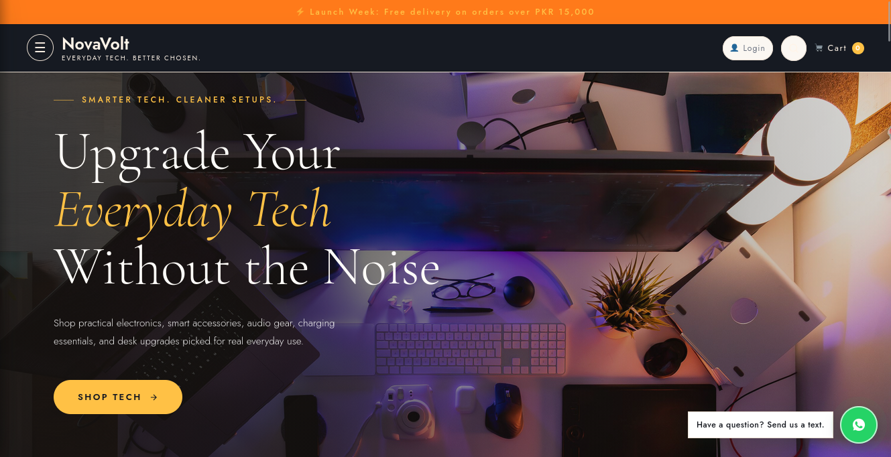
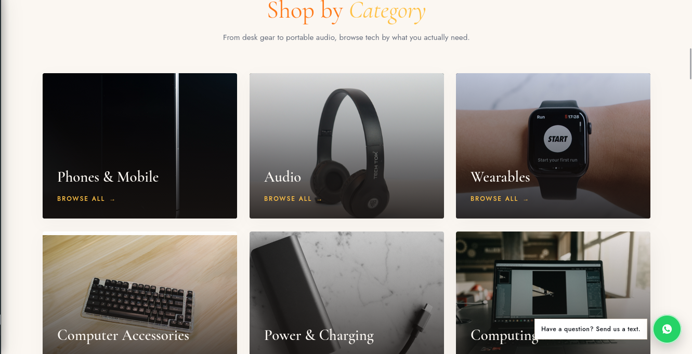
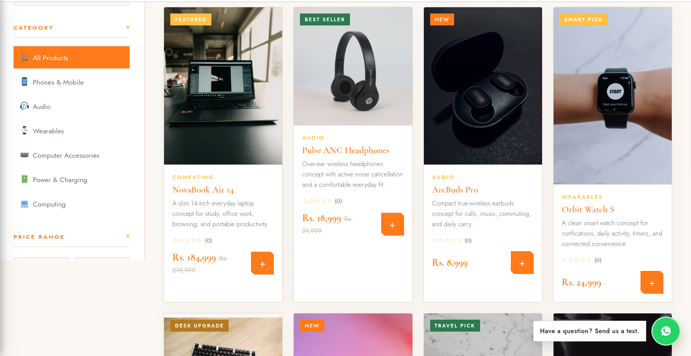
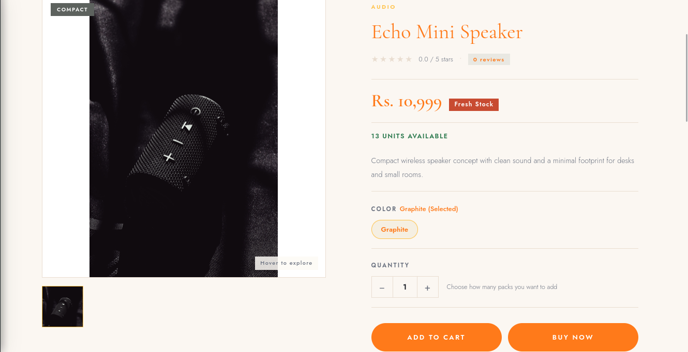
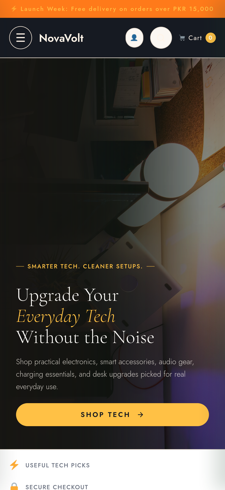

# StorefrontCMS Ecommerce CMS Lite

> 🚀 **Want the full version?** Stripe, PayPal, Google Sign-In, SMTP, 
> white-label ready → [Get the Full Edition on Whop](https://whop.com/burhan-builds/reusable-ecommerce-cms-website-with-admin-panel/)

A free, reusable **Node.js ecommerce CMS starter** for electronics, accessories, food, beauty and other product stores.

Built with **Node.js, Express, EJS and MongoDB**.

## Screenshots

### Storefront


### Categories


### Products


### Product Details


### Mobile Storefront


## Features

- Secure admin setup and login
- Product add/edit/delete
- Categories
- Local product image uploads
- Basic price and stock management
- Responsive storefront
- Product search and filtering
- Shopping cart
- Guest checkout
- Cash on Delivery / manual orders
- Admin order management
- Order status updates
- Automatic stock reduction and restoration on cancellation
- Basic SEO meta titles and descriptions

## Tech Stack

**Node.js · Express.js · MongoDB · Mongoose · EJS · HTML · CSS · JavaScript**

## Lite vs Full Version

StorefrontCMS Lite includes the essential ecommerce workflow.

The **Full Edition** adds:

- Theme and branding customization
- Homepage builder
- Customer accounts
- Stripe & PayPal
- Coupons and bundles
- Reviews and wishlist
- Blog CMS
- Advanced variants & inventory
- Cloudinary
- Email/SMTP
- CSV import/export
- Backup & restore
- Advanced shipping and checkout controls
- Advanced SEO
- Analytics and reports
- Additional CMS settings and integrations

## Quick Start

```bash
npm install
npm start
```

Copy `.env.example` to `.env`, configure `MONGODB_URI` and `SESSION_SECRET`, then open:

```text
http://localhost:3000/admin
```

Create the first administrator, add categories and start adding products.

## Product Images

Lite uses local image uploads and supports **JPG, PNG and WebP** files, with up to **4 images per product**.

## Checkout

StorefrontCMS Lite uses **guest checkout** with Cash on Delivery / manual order placement. No customer account is required.

---

If you find StorefrontCMS Lite useful, consider giving the repository a **⭐ star**.
